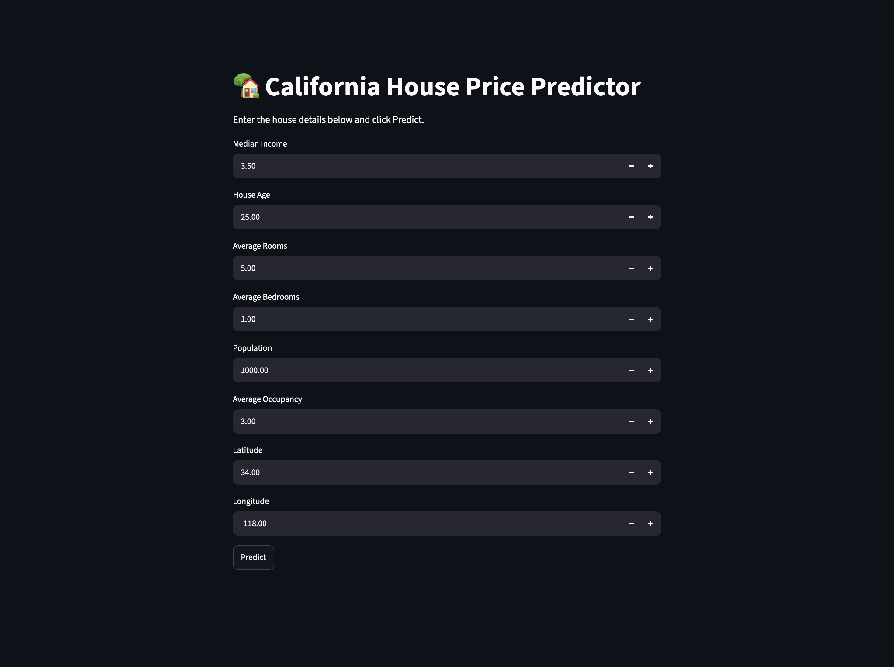
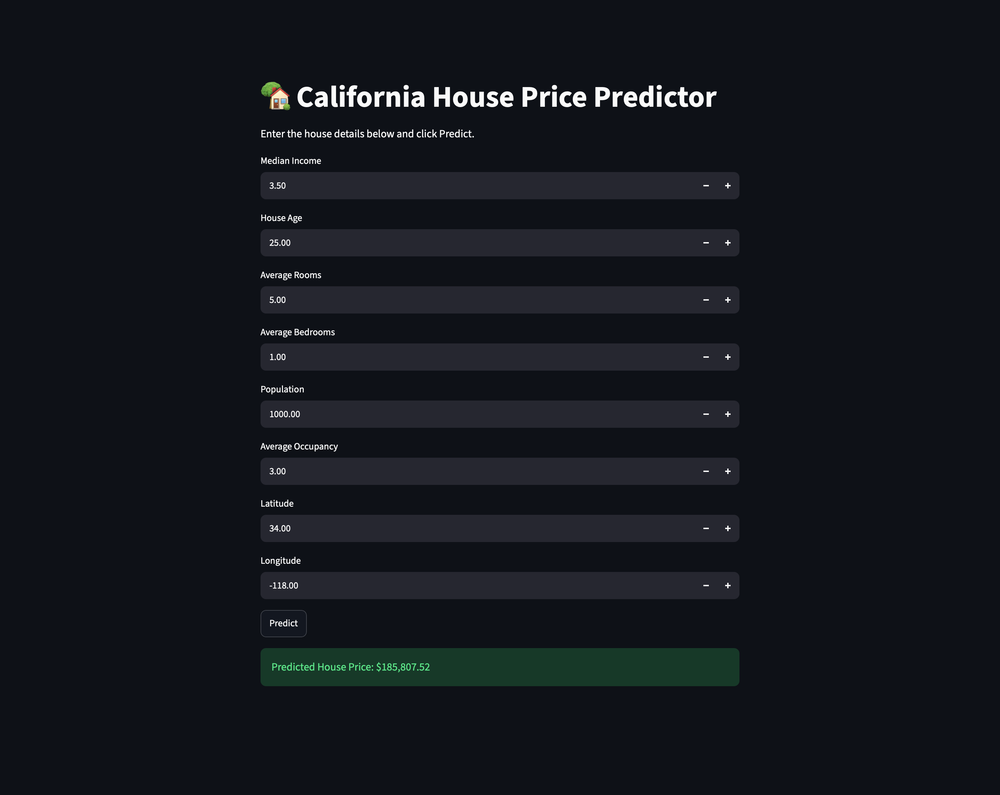

# 🏡 California House Price Predictor

A Machine Learning web application that predicts California house prices using **Linear Regression** and the **California Housing Dataset** from Scikit-learn.

The application provides an interactive web interface built with **Streamlit**, allowing users to enter housing features and instantly receive a predicted house price.

---

## 📸 Application Preview

### Home Screen



### Prediction Result



---

## 🚀 Features

- Predict California house prices
- Interactive Streamlit web application
- Linear Regression model trained using Scikit-learn
- Simple and clean user interface
- Real-time predictions

---

## 🧠 Machine Learning Workflow

1. Load the California Housing Dataset
2. Split the dataset into training and testing sets
3. Train a Linear Regression model
4. Evaluate the model using RMSE and R² Score
5. Save the trained model using Joblib
6. Load the saved model inside the Streamlit application
7. Accept user inputs and predict house prices

---

## 📊 Input Features

The model uses the following features:

- Median Income
- House Age
- Average Rooms
- Average Bedrooms
- Population
- Average Occupancy
- Latitude
- Longitude

---

## 🛠️ Technologies Used

- Python
- NumPy
- Scikit-learn
- Streamlit
- Joblib
- Git
- GitHub

---

## 📂 Project Structure

```text
HousePricePredictionLR/
│
├── app.py
├── train.py
├── requirements.txt
├── README.md
├── .gitignore
│
├── model/
│   └── house_price_model.pkl
│
├── screenshots/
│   ├── home.png
│   └── prediction.png
│
└── venv/
```

---

## ▶️ Installation

Clone the repository:

```bash
git clone <repository-url>
```

Move into the project folder:

```bash
cd HousePricePredictionLR
```

Create a virtual environment:

```bash
python3 -m venv venv
```

Activate it:

### macOS / Linux

```bash
source venv/bin/activate
```

### Windows

```bash
venv\Scripts\activate
```

Install dependencies:

```bash
pip install -r requirements.txt
```

Run the application:

```bash
streamlit run app.py
```

---

## 📈 Model Performance

| Metric | Value |
|---------|-------|
| RMSE | 0.745 |
| R² Score | 0.576 |

---

## 👨‍💻 Author

Aryan Fulari

Learning Machine Learning and building end-to-end projects using Python, Scikit-learn and Streamlit.